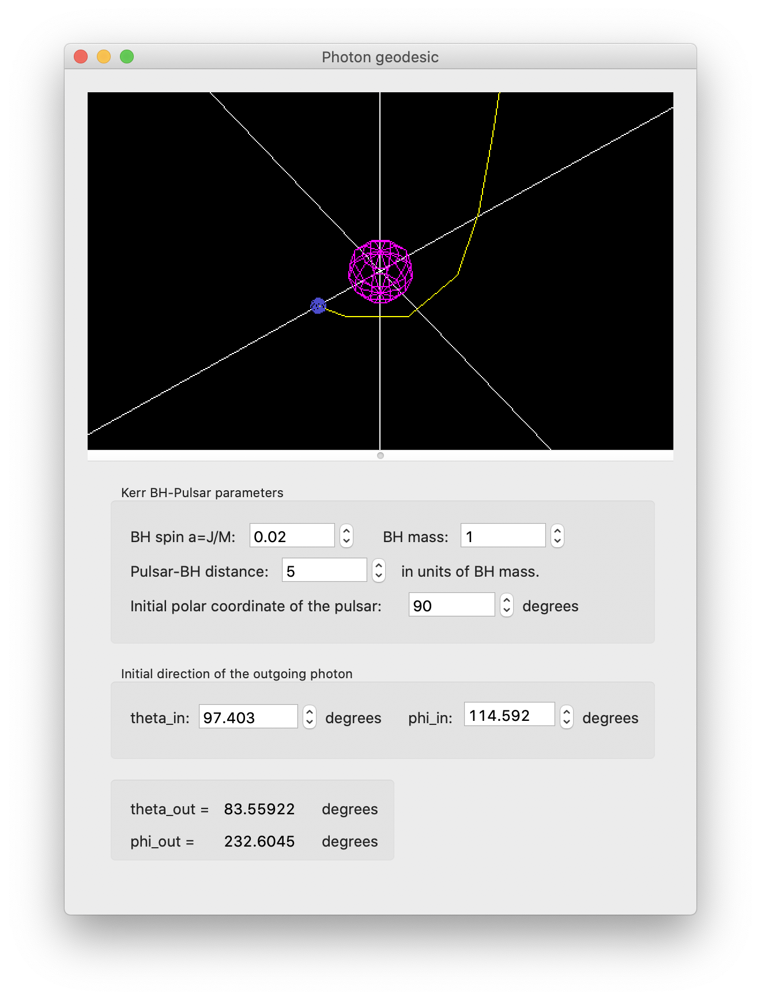

# Geodesic Calculator

This program intends to visualize the trajectory that a photon takes when passing near a black hole. In technical terms, it calculates the null geodesics around a Kerr black hole, given some initial conditions of the photon trajectory.

The input conditions are the pulsar position and the initial shooting direction of the photon from the pulsar.

The pulsar is not restricted to the rotational plane of the black hole. It can be placed anywhere on space. The black hole parameters for mass and angular momentum can be varied independently too.

---

(c) Martin Beroiz - martinberoiz@gmail.com
